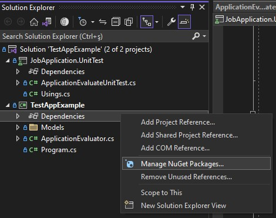
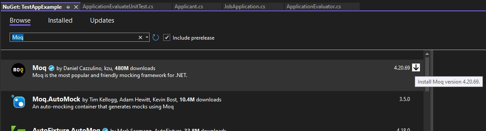
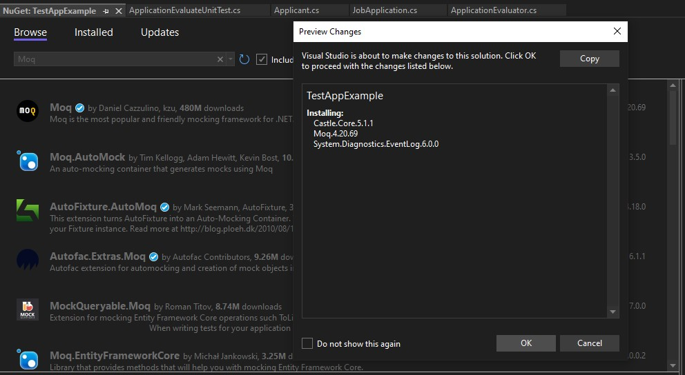

# Windows

- Dependencies üzerine sağ tıklayıp **Manage Nuget Packeges** seçeneğini seçin




- Açılan menüde **Browse** kısmında **Moq** araması yapıp en üstteki paketi indirin




- İndirme esnasında herhangi bir uyarı çıkması durumunda **kabul edin**.




# Linux/Cli

- Moq kütüphanesini Linux içerisine indirebilmek için projenin **.csproj** dosyasının bulunduğu yerde terminal aç. Bu örnek için açılması gereken klasör:

```
TestAppExample/TestAppExample/TestAppExample.csproj
```


- Burada terminal aç ve aşağıdaki komutu yaz

```console
dotnet add package Moq
```