# Windows

## Snippet eklemek

- İlk önce tools menüsünden **code snipper manager** seçilir

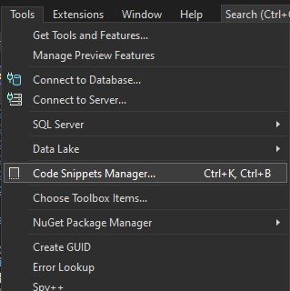


- Karşımıza çıkan pencerede **Import** seçeneği seçilir ve [**UnitTestSnippet.snippet**](snippetOluşturma/UnitTestSnippet.snippet) dosyası seçilir

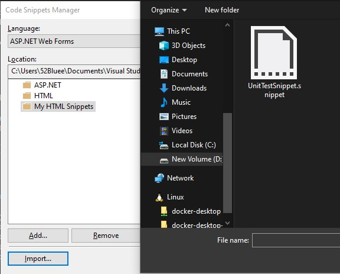


- Bu pencerede **Finish** seçeneği seçilir ve işlem tamamlanmış olur

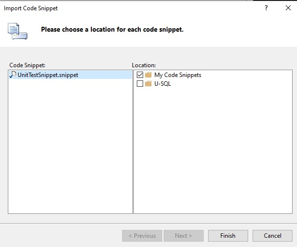


## Snippetin eklenip eklenmediğini kontrol etmek

- Snippetin eklenip eklenmediğini kontrol etmek için gerekirse tekrardan *code snipper manager* açılır ve **Language** ise **CSharp** olarak seçilir. Eklenen snippet örnekteki gibi görünüyorsa sorun yoktur.

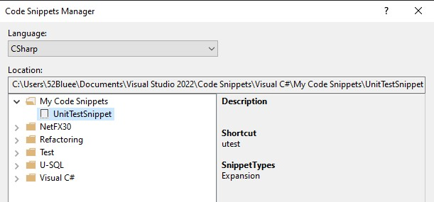


## Snippetin çalıştırılması

- Şimdi kullanmak için herhangi bir *.cs* dosyası açıp **utest** yazıp iki kez *tab* tuşuna basın. Sonuç aşağıdaki gibi olacaktır.

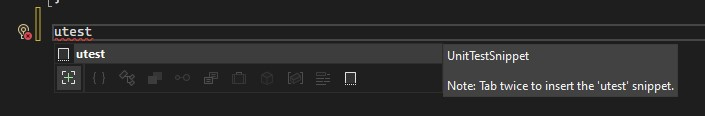
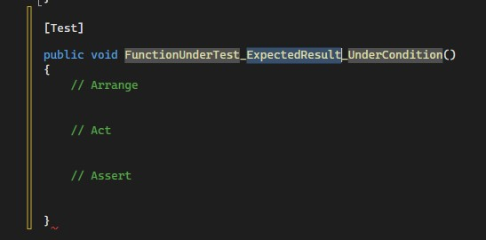


Not: Eğer **utest** dışında bir snippet kısayolu atamak isterseniz, [**UnitTestSnippet.snippet**](snippetOluşturma/UnitTestSnippet.snippet) dosyası içerisindeki ilgili yeri (satır 17) değiştirmeniz gerekmektedir.

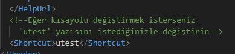


# Linux / VsCode

## Snippet Eklemek

- İlk olarak **Ctrl+Shift+P** kombinasyonu ile **Komut Paleti** açılır

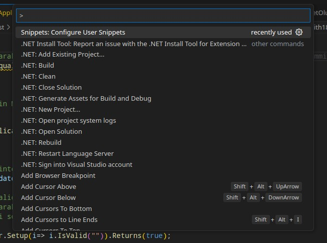


- Buraya **Configure User Snippet** yazılır ve **csharp** seçilir

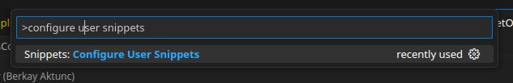
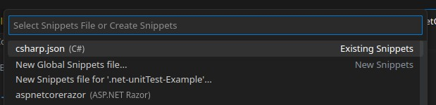


- Açılan dosyaya aşağıdaki kod parçası resimdeki gibi eklenir ve kaydedilir

```json
"Print to cosole": {
    "prefix": "utest",
    "body": [
        "[Test]",
        "public void Temp(){",
        "	// Arrange",
        "",
        "	// Act",
        "",
        "	// Assert",
        "}",
    ],
    "description": "[UTEST] csharp UnitTest template."
}
```

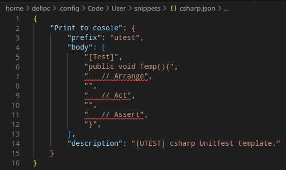


## Snippetin çalıştırılması

- Şimdi kullanmak için herhangi bir *.cs* dosyası açıp **utest** yazıp bir kez *tab* tuşuna basın. Sonuç aşağıdaki gibi olacaktır.

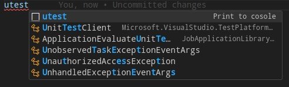
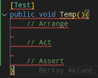