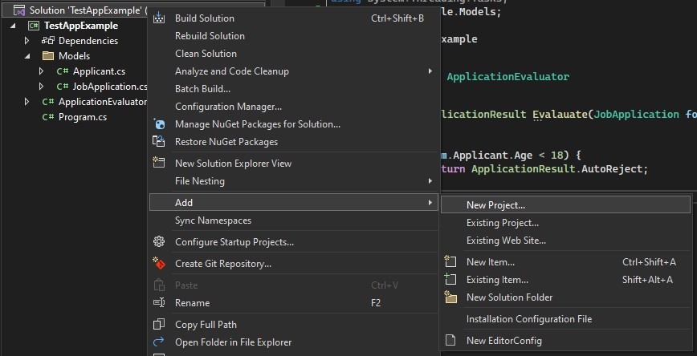
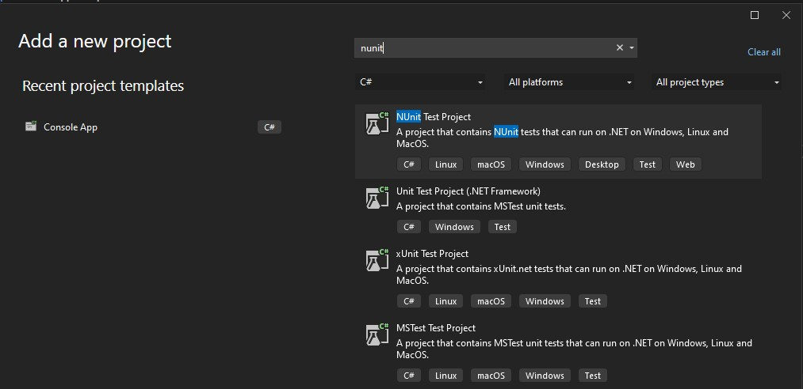
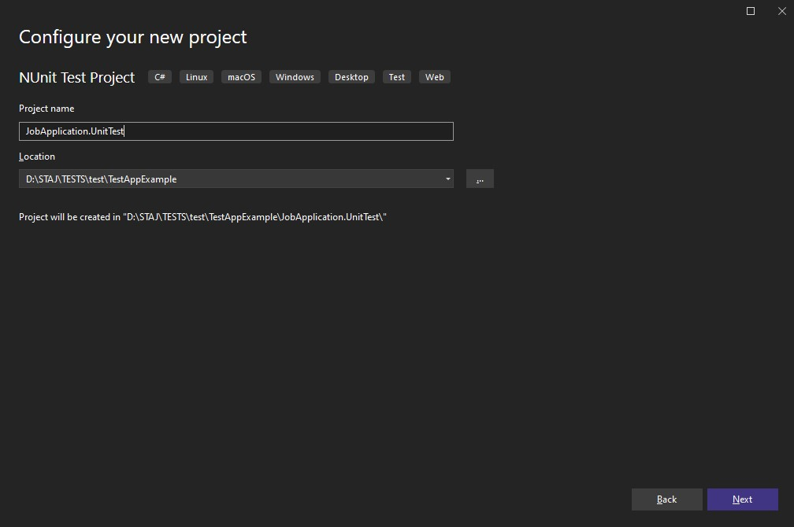
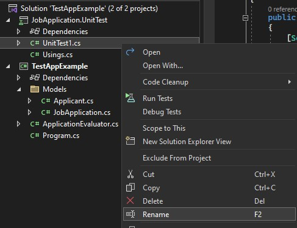
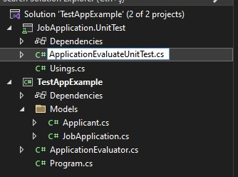
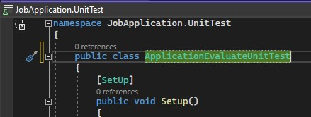
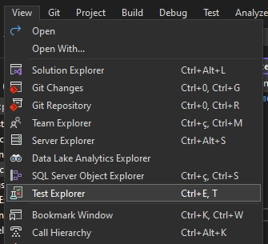
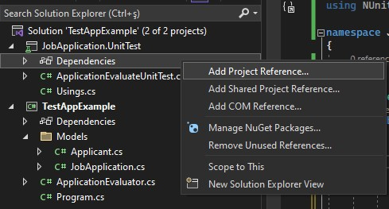
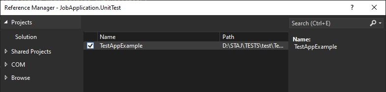
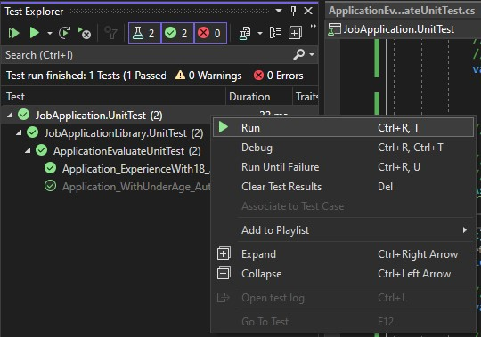

## Test projesi oluşturmak

- İlk olarak yeni bir proje eklenir

- Proje **NUnit Test Project** olarak açılır

- İsimlendirme **TestEdilecekClassİsmi.UnitTest** şeklinde olmalıdır

- Yeni açılan projedeki dosyanın isimlendirilmesi da doğru yapılmalı

- Bu örnekte **ApplicationEvaluate** için bir unit test yazıldığı açık bir şekilde anlaşılıyor

- Bu adımın hemen ardından class için de doüzgün bir ism verilmeli

- Yazılan testin çalıştırılması için __Test Explorer__in ekranda gösterilmesi gerekli.

## Test edilecek projeyi dependency olarak eklemek

- Son ve en önemli adımlardan biri ise test edilen projeyi, yeni açılan test projesine dependency olarak ekleme.

## Yazılan test methodunu çalıştırmak

- Yazılan testin çalıştırılması için birkaç yöntem vardır. Sadece yazılan methodun çalışması isteniyorsa, methotun hemen yanında çıkan butona basarak **Run** seçeneği seçilebilir.

-Eğer yazılan tüm test methotları tek seferde çalıştırılsın isteniyor ise **Test Explorer** penceresinden şekildeki sağlanabilir.

